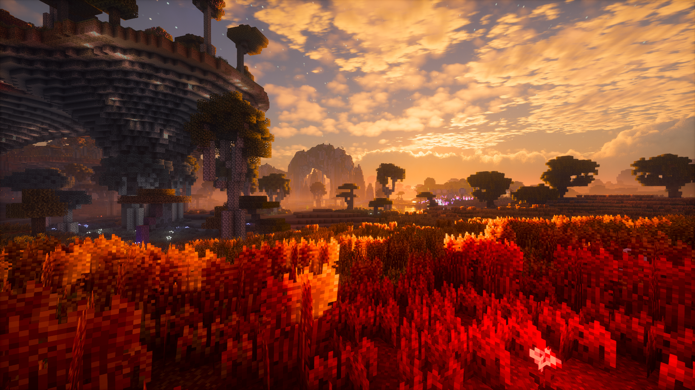

  

<h1 align = "center">Photon Shaders</h1>

A gameplay-focused shader pack for Minecraft

## 个人修改的photon-GAMS版本（同步了一些自己喜欢的photon正式版的更新内容）
* 个人版本特色
  * 更多流星的设置项，方型星星，添加挤压植物设置项，优化雨水坑效果
  * 增加了镜头光晕
  * 同步一些photon正式版的效果：水波，地狱门边缘发光，彩虹🌈，闪电照亮天空（需要开启辅助功能设置关闭隐藏闪烁）,优化月亮效果，同步photon正式版优化代码
  * 修复原GAMS的bug：旗帜只显示白色bug，篝火烤食物不显示bug，雨水坑出现在水底以及室内bug
  * 部分奇奇怪怪的bug（本人能力有限，只会Ctrl+C，Ctrl+V）
  * ~~增加了雨水镜头效果（渣机太卡了，删了，后续可能会重新加）~~
  * 个人使用的配置在Photon-GAMS-main.zip.txt文件里面，使用教程参考视频https://www.bilibili.com/video/BV1ok4y1K7k9/
  * 下载地址https://github.com/9961qqq/Photon-GAMS-PLUS/releases/tag/dev

## Acknowledgments

* Menu translations: 
  * [NakiriRuri](https://github.com/NakiriRuri) and [OrzMiku](https://github.com/Orzmiku) (Chinese)
  * [Jmayk](https://github.com/Jmayk-dev) (Italian)
  * [Timtaran](https://github.com/Timtaran) (Russian)
* [Emin](https://github.com/EminGT) - Shadow bias method from [Complementary Reimagined](https://www.complementary.dev/shaders/) (fully fixes peter panning and light leaking underground!)
* [DrDesten](https://github.com/DrDesten) - Depth tolerance calculation for SSR (helps to prevent false reflections)
* [Jessie](https://github.com/Jessie-LC) - f0 and f82 values for labPBR hardcoded metals
* [Sledgehammer Games](https://www.sledgehammergames.com/) - Bloom downsampling method used in Call of Duty Advanced Warfare (described [here](http://www.iryoku.com/next-generation-post-processing-in-call-of-duty-advanced-warfare))
* http://momentsingraphics.de/ - Blue noise texture
* [NASA Scientific Visualization Studio](https://svs.gsfc.nasa.gov/4851) - Galaxy image